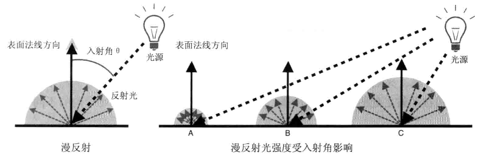

## 本节内容

明暗、阴影、不同光的类型：点光源、平行光和散射光。
物体表面反射光线的方式：漫反射和环境反射。
编写代码实现光照效果。

## 光照原理

现实世界中的物体被光线照射时，会反射一部分光，只有反射光线进入你的眼睛时，你才能够看到物体并辨认出它的颜色。白色物体反射白光，白光进入你的眼睛时，才能看到物体是白色的。

现实世界中，当光线照到物体上时，发生两个重要的现象：
* 根据光源和光线方向，物体不同表面的明暗程度变得不一致。
* 根据光源和光线方向，物体向地面投下了影子。

在生活中常常会注意到阴影，却很少注意明暗差异。实际上明暗差异给了物体立体感，虽然难以察觉，但它始终存在。

在三维图形学中术语 **着色**(shading) 的真正含义就是，根据光照条件重建“物体各表面明暗不一致的效果”的过程。物体向地面投下影子的现象，又被称为 **阴影** (shadowing)。

在讨论着色过程之前，考虑两件事情：
* 发出光线的光源类型。
* 物体表面如何反射光线。 

光源类型：
* 平行光：平行光的光线是相互平行的，具有方向性。类似于自然中的太阳光。可以用一个方向和一个颜色来定义。
* 点光源：从一个点向周围的所有方向发现的光，类似于人造的灯泡的光，如灯泡、火焰。
* 环境光：也叫间接光，真实世界中非直射光，是指哪些经光源（点或平行光源）发出后，被墙壁等物体多次反射，然后照到物体表面上的光，环境光从各个角度照射物体，其强度都是一致的。不用指定位置与方向，只需要指定颜色即可。
* 聚光灯光：模拟电筒、车前灯，探照灯等。

反射类型：
* 漫反射：针对平行光或点光源而言的。漫反射的反射光在各个方向上是均匀的。大部分物体表面是粗糙的，如纸张、岩石、塑料等，在这种情况下反射光就会以不固定的角度反射出去。漫反射就是针对后一种情况而建立的理想反射模型 。

  

* 环境反射：针对环境光而言。反射光的方向可以认为就是入射光的方向。由于环境光照射物体的方式就是各方向均匀、强度相等的，所以反射光也是各方向均匀。

